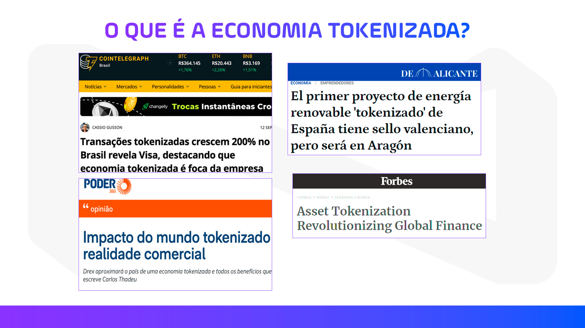
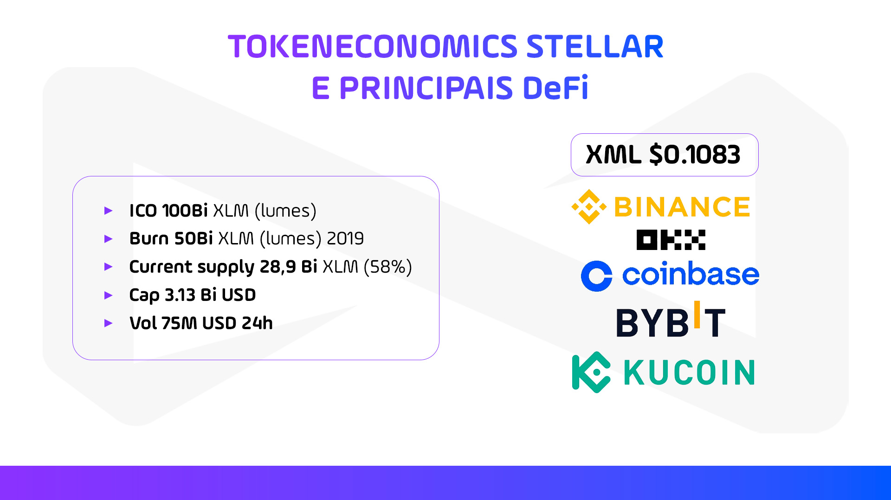
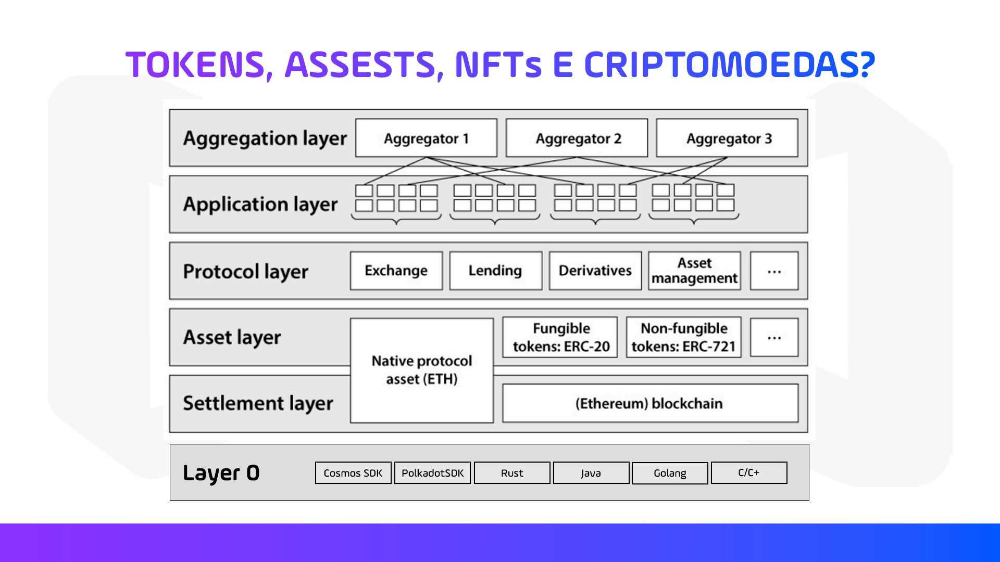
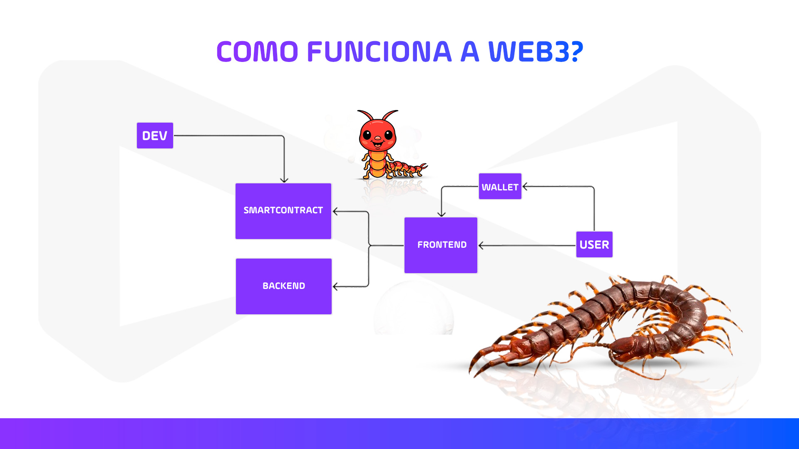
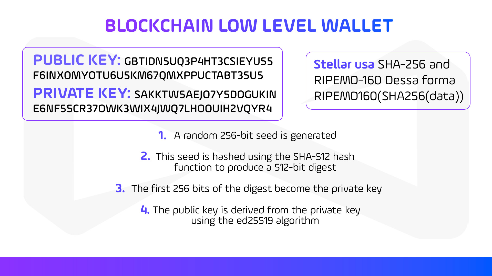
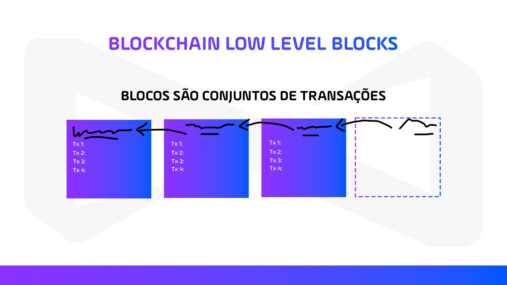
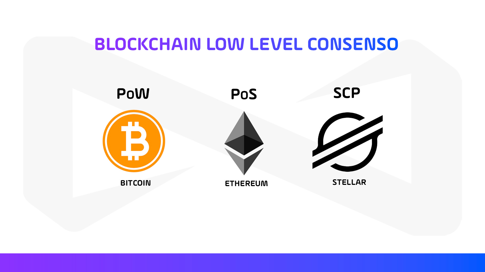
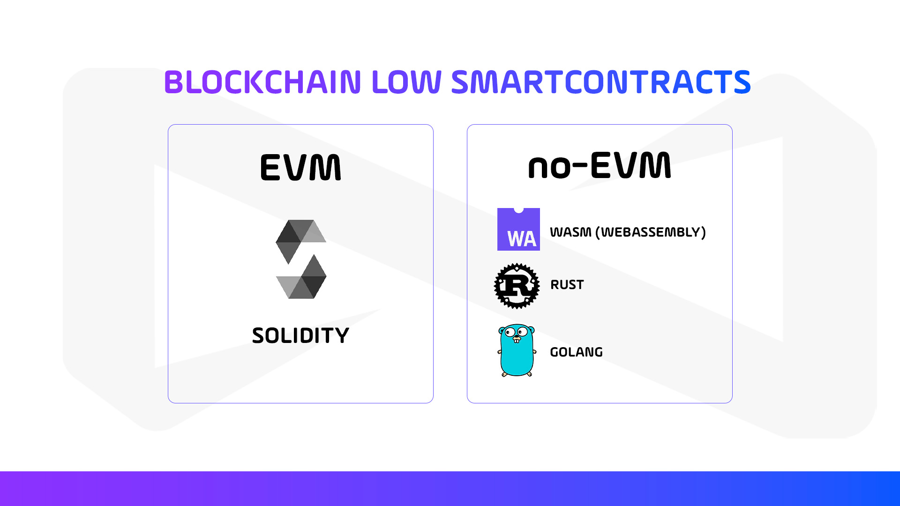
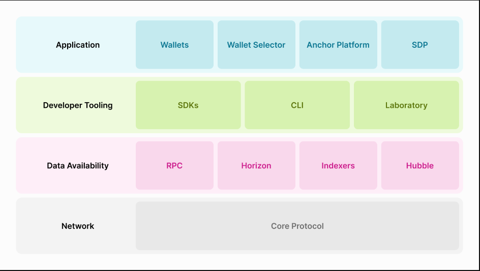

<h1 align="center">🚀 NearX - Stellar Bootcamp</h1>

<h1 align="center">

:pushpin: [Aula 1 - DeFi & Economia Tokenizada: Tokens, Criptomoedas e Web3 Desvendados](https://www.youtube.com/live/ZxGUWEGKgZ8?si=pxw_EkvV__Y0H51Y)

</h1>

<p align="left">

### O que é DeFi? 
<p align="center">
  
</p>

**DeFi**, ou **Decentralized Finance (Finanças Descentralizadas)**, é um movimento que utiliza tecnologia blockchain para criar serviços financeiros sem a necessidade de intermediários tradicionais, como bancos ou corretoras.

#### Aqui estão alguns pontos-chave sobre o DeFi:

- **Descentralização:** As transações ocorrem diretamente entre os usuários, sem a necessidade de autoridades centralizadas.

- **Contratos Inteligentes:** Utilizam programas autoexecutáveis (smart contracts) para automatizar operações financeiras, como empréstimos e pagamentos.

- **Transparência:** Todas as transações são registradas na blockchain, tornando-as auditáveis e transparentes.

- **Acessibilidade:** Qualquer pessoa com acesso à internet pode participar, eliminando processos burocráticos complexos.

- **Interoperabilidade:** Muitos protocolos DeFi são projetados para funcionar de forma integrada com outros serviços dentro do ecossistema blockchain.

<br>

O **DeFi** está revolucionando a forma como lidamos com serviços financeiros, oferecendo mais autonomia, eficiência e transparência.

Por outro lado, temos o **TradFi**, ou **Traditional Finance (Finanças Tradicionais)**, que opera dentro de um sistema mais estruturado e regulamentado, mas com maior dependência de intermediários e processos burocráticos.

#### Comparando TradFi e DeFi

| Aspecto                | TradFi                            | DeFi                               |
|------------------------|-----------------------------------|------------------------------------|
| **Centralização**      | Instituições Financeiras          | Blockchain                         |
| **Intermediação**      | Necessário                        | Não necessário                     |
| **Transparência**      | Limitada                          | Alta, graças à blockchain          |
| **Acesso**             | Restrito                          | Acessível a qualquer pessoa com internet |
| **Segurança**          | Regulamentado                     | Contratos inteligentes e blockchain |
| **Eficiência**         | Processos mais lentos e caros     | Automação e eficiência com contratos inteligentes |

<br>

Enquanto o **TradFi** oferece segurança e regulamentação dentro de um sistema centralizado, o **DeFi** proporciona maior transparência, acessibilidade e eficiência através da descentralização e da automação. Ambos têm seus méritos e limitações, e o futuro pode ver uma integração maior entre essas duas abordagens, trazendo o melhor dos dois mundos para os usuários.

<br>

### O que é economia tokenizada?
<p align="center">
  
</p>

A **economia tokenizada** é um conceito inovador que está ganhando destaque, especialmente com o avanço das tecnologias de blockchain e criptografia. Em essência, trata-se da criação de tokens digitais que representam ativos do mundo real ou virtuais. Esses tokens podem ser utilizados para uma variedade de finalidades, como transações, investimentos e até programas de fidelidade.

<br>

A economia tokenizada e o dinheiro programável são conceitos complementares que estão impulsionando a transformação digital do setor financeiro.

#### Economia Tokenizada:

- **Tokens Digitais:** Representam ativos do mundo real ou virtuais, facilitando a negociação e a transação desses ativos na blockchain.

- **Blockchain:** Tecnologia que sustenta a economia tokenizada, garantindo segurança e transparência nas transações.

- **Transparência e Segurança:** Transações registradas na blockchain são difíceis de adulterar, promovendo confiança.

- **Descentralização:** Elimina a necessidade de intermediários, como bancos e corretores.

- **Acessibilidade:** Democratiza o acesso a investimentos e transações, tornando-os mais acessíveis a um público mais amplo.

#### Dinheiro Programável:

- **Contratos Inteligentes:** Contratos autoexecutáveis com termos escritos em código, garantindo que condições específicas sejam cumpridas antes da liberação dos fundos.

- **Autonomia e Eficiência:** Reduz a necessidade de intermediários, diminuindo custos e aumentando a eficiência.

- **Personalização:** Permite soluções financeiras personalizadas, como pagamentos automáticos e gestão de doações.

- **Segurança:** Garantida pela tecnologia blockchain, difícil de ser adulterada.

- **Transparência:** Regras e transações são transparentes e imutáveis, promovendo maior confiança entre as partes.

Ambos os conceitos são partes essenciais da nova era das finanças digitais, oferecendo mais flexibilidade, segurança e eficiência.

<br>

### Tokenecomics Stellar, principais DeFi.
<p align="center">
  
</p>

#### Tokenomics do Stellar (XLM)

- **Nome:** Stellar Lumens (XLM)

- **Fundo de Desenvolvimento:** A Stellar Development Foundation (SDF) é responsável pelo desenvolvimento e promoção da rede Stellar.

- **Oferta Total:** 50 bilhões de XLM.

- **Oferta Circulante:** 28,9 bilhões de XLM.

- **Uso:** XLM é usado para pagar taxas de transação na rede Stellar e como uma ponte para facilitar transações internacionais.

- **Consensus Protocol:** Stellar usa o Stellar Consensus Protocol (SCP), que é um mecanismo de consenso federado que não depende de mineração.

- **Velocidade:** A rede Stellar pode processar até 1.000 transações por segundo.

- **Interoperabilidade:** Permite a criação e troca de ativos digitais, facilitando a integração com o sistema financeiro tradicional.

#### Principais Protocolos DeFi

- **Aave (AAVE):** Plataforma descentralizada para empréstimos e empréstimos flash.

- **Maker (MKR):** Criador do stablecoin DAI e plataforma para empréstimos descentralizados.

- **Uniswap (UNI):** Exchange descentralizada de criptomoedas que permite a negociação sem intermediários.

- **Chainlink (LINK):** Fornece dados externos para contratos inteligentes, essencial para muitas aplicações DeFi.

- **PancakeSwap (CAKE):** Exchange descentralizada na Binance Smart Chain, conhecida por suas taxas baixas.

- **Avalanche (AVAX):** Plataforma de contratos inteligentes rápida e escalável.

- **Ethereum (ETH):** A maior plataforma DeFi, onde muitos projetos DeFi são construídos.

- **Fantom (FTM):** Rede de blockchain projetada para alta escalabilidade e baixo custo.

- **Lido DAO (LDO):** Plataforma para staking de ativos em várias redes blockchain.

- **Jupiter (JUP):** Protocolo DeFi que facilita a interoperabilidade entre diferentes blockchains.

Esses protocolos são alguns dos principais exemplos de como o DeFi está transformando o setor financeiro, oferecendo soluções descentralizadas, transparentes e acessíveis.

<br>

### O que são Tokens, Assets e Criptomoedas?
<p align="center">
  
</p>

A imagem oferece uma visão clara e relevante sobre os diferentes componentes e camadas do ecossistema de blockchain e criptomoedas, destacando suas interações e integrações. Ela ilustra um diagrama com várias camadas que fazem parte deste ecossistema, incluindo tokens, ativos, NFTs e criptomoedas. Aqui está um resumo das camadas apresentadas:

- **Camada de Agregação (Aggregation layer):** Inclui Agregador 1, Agregador 2 e Agregador 3.
  - Esta camada agrupa e consolida dados de várias fontes diferentes, fornecendo uma visão abrangente dos ativos disponíveis, taxas de câmbio, oportunidades de empréstimo, etc. Esses agregadores facilitam a busca e comparação de informações para os usuários.

- **Camada de Aplicação (Application layer):** Inclui várias aplicações, como troca, empréstimo, derivativos, gestão de ativos, entre outras.
  - Esta camada é onde os usuários interagem diretamente com diferentes serviços financeiros. Aplicações de troca permitem a compra e venda de criptomoedas, aplicações de empréstimo permitem que usuários emprestem e tomem emprestado criptomoedas, e as aplicações de derivativos permitem a negociação de contratos baseados em criptomoedas. A gestão de ativos inclui ferramentas e serviços para ajudar os usuários a gerenciar seus investimentos.

- **Camada de Protocolo (Protocol layer):** Inclui protocolos para troca, empréstimo, derivativos e gestão de ativos.
  - Estes são os "regramentos" ou "contratos" que governam as operações das aplicações. Eles definem como as transações são realizadas, verificadas e registradas. Cada tipo de aplicação (troca, empréstimo, etc.) tem protocolos específicos que asseguram sua funcionalidade e segurança.

- **Camada de Ativos (Asset layer):** Inclui ativos nativos do protocolo (ETH), tokens fungíveis (ERC-20) e tokens não fungíveis (ERC-721).
  - Esta camada inclui todos os tipos de ativos digitais. O ETH (Ethereum) é o ativo nativo da blockchain Ethereum. Tokens fungíveis (ERC-20) são tokens que têm o mesmo valor e são intercambiáveis (como moedas). Tokens não fungíveis (ERC-721) são únicos e não intercambiáveis, frequentemente usados para representar itens digitais colecionáveis ou arte digital (NFTs).

- **Camada de Liquidação (Settlement layer):** Inclui a blockchain Ethereum.
  - Esta é a camada onde as transações são finalizadas e registradas de forma permanente. A blockchain Ethereum é um ledger distribuído que assegura que todas as transações são transparentes, imutáveis e verificáveis por qualquer pessoa.

- **Camada 0 (Layer 0):** Inclui ferramentas de desenvolvimento e linguagens como Cosmos SDK, Polkadot SDK, Rust, Java, Golang e C/C++.
  - Esta camada inclui as ferramentas e tecnologias básicas usadas para criar e desenvolver todas as outras camadas e aplicações. As ferramentas de desenvolvimento ajudam os programadores a criar blockchains e dApps (aplicações descentralizadas) de forma mais eficiente. As linguagens de programação são usadas para escrever o código que alimenta esses sistemas.

Cada camada desempenha um papel essencial no funcionamento geral do ecossistema de criptomoedas e blockchain, desde a base tecnológica até a interação direta do usuário.

<br>

### Como funciona a web3?
<p align="center">
  
</p>

A Web3 representa uma nova era da internet, onde a descentralização é a chave. Em vez de depender de intermediários centralizados, os aplicativos e serviços na Web3 utilizam a tecnologia blockchain para operar de forma independente e segura.

#### Vamos desvendar os principais elementos:

- **Desenvolvedor (DEV):** O processo começa com o desenvolvedor que cria o código e os aplicativos.

- **Contrato Inteligente (SMARTCONTRACT):** O desenvolvedor programa contratos inteligentes, que são essencialmente contratos autoexecutáveis com os termos do acordo diretamente escritos no código.

- **Backend e Frontend:** Os contratos inteligentes se conectam tanto ao backend (parte do aplicativo que gerencia a lógica e a base de dados) quanto ao frontend (a interface do usuário).

- **Carteira (WALLET):** A interface do usuário se conecta a uma carteira digital, que é usada para gerenciar as criptomoedas e outras chaves digitais.

- **Usuário (USER):** O usuário interage com o frontend do aplicativo e usa a carteira para realizar transações.

<br>

### Como a Stellar se encaixa no mundo web3?

A **Stellar** é uma plataforma blockchain projetada para facilitar transações financeiras rápidas e acessíveis em todo o mundo. Ela se encaixa na Web3 ao permitir a criação e troca de ativos digitais (tokens) de maneira descentralizada e segura. Aqui estão alguns pontos-chave sobre como a Stellar se integra à Web3:

 - **Tokenização de Ativos:** A Stellar permite a criação de tokens representando ativos financeiros ou outros tipos de valor, facilitando a troca e a liquidez.

- **Transações Rápidas e Econômicas:** A Stellar oferece taxas de transação muito baixas e tempos de processamento rápidos, o que é crucial para aplicações financeiras em tempo real.

- **Interoperabilidade:** A Stellar se conecta a várias moedas fiduciárias e outras plataformas blockchain, permitindo a transferência de valor entre diferentes sistemas.

- **Desenvolvimento de Aplicações:** A Stellar fornece ferramentas e SDKs (kits de desenvolvimento de software) que facilitam a criação de aplicativos descentralizados (dApps) e contratos inteligentes.

- **Foco em Inclusão Financeira:** A Stellar tem como objetivo tornar os serviços financeiros mais acessíveis a pessoas em todo o mundo, especialmente em regiões onde o acesso a serviços bancários tradicionais é limitado.

Em resumo, a **Stellar** é uma plataforma blockchain que se alinha bem com os princípios da Web3, promovendo a descentralização, a interoperabilidade e a inclusão financeira. 

<br>

### Blockchain low-level: wallet
<p align="center">
  
</p>

**Blockchain low-level wallet** é um termo técnico que se refere a um tipo de carteira de criptomoedas que opera diretamente na camada mais baixa da infraestrutura blockchain. Em outras palavras, é uma carteira que interage diretamente com a blockchain sem a necessidade de intermediários ou serviços adicionais.

Essa imagem é relevante pois explica o processo de geração de chaves criptográficas para carteiras blockchain, crucial para garantir transações seguras na tecnologia blockchain.

#### Aqui estão os elementos principais e seu significado:

- **Chave Pública:** GBTIDN5UQ3P4HT3CSIEYU5SF6INX0MYOTU6U5KM67QMXPPUCTABT35U5

  - Utilizada para receber transações na rede blockchain.

- **Chave Privada:** SAKKTW5AEJ07Y5DOGUKINE6NFS5CR370WK3WIX4JWQ7LHOOUIH2VQYR4

  - Mantida em segredo e usada para assinar transações, provando a propriedade dos fundos.

- **Algoritmos Utilizados:**

  - O Stellar usa uma combinação dos algoritmos SHA-256 e RIPEMD-160 para aumentar a segurança: RIPEMD160(SHA256(data)).

- **Passos para a Geração de Chaves:**

  - Um seed aleatório de 256 bits é gerado.

  - Esse seed é hashado usando a função hash SHA-512, produzindo um digest de 512 bits.

  - Os primeiros 256 bits do digest se tornam a chave privada.

  - A chave pública é derivada da chave privada usando o algoritmo ed25519.

#### Aqui estão alguns pontos chave sobre essas carteiras:

- **Chave Privada e Pública:** Cada carteira possui uma chave privada e uma chave pública. A chave privada é um segredo que você deve manter seguro, enquanto a chave pública é usada para receber transações.

- **Transações Diretas:** As carteiras low-level permitem que você envie e receba transações diretamente na blockchain. Isso significa que você tem controle total sobre suas transações sem depender de terceiros.

- **Segurança:** Como você mantém controle direto sobre suas chaves, a segurança das suas transações e fundos depende de como você protege suas chaves privadas.

- **Software e Hardware:** Existem dois tipos principais de carteiras low-level: software wallets (aplicativos que você instala no seu dispositivo) e hardware wallets (dispositivos físicos projetados para armazenar chaves de forma segura).

<br>

### Blockchain low-level: Tx
<p align="center">
  
</p>

A imagem ilustra o processo onde uma chave privada e uma transação são combinadas para criar uma assinatura. Essa assinatura, junto com a chave pública, resulta em uma transação assinada. Esse processo é fundamental na tecnologia blockchain para garantir a autenticidade e a integridade das transações.

<br>


### Blockchain low-level: Blocks
<p align="center">
  
</p>

Essa imagem ajuda a ilustrar como os blocos na blockchain são compostos por conjuntos de transações e como eles se conectam formando uma cadeia contínua. A blockchain é como um livro-razão digital descentralizado que registra todas as transações de forma segura e imutável. Cada bloco contém um conjunto de transações, e todos os blocos estão interligados, formando uma cadeia (daí o nome "blockchain").

#### Aqui estão os principais componentes de um bloco em nível baixo:

- **Cabeçalho do Bloco:** Contém metadados sobre o bloco, como a versão, o hash do bloco anterior, o hash do Merkle root (que é uma árvore hash que resume todas as transações no bloco), um timestamp, a dificuldade de mineração, e o nonce (um número usado uma única vez).

- **Transações:** O bloco contém uma lista de transações. Cada transação representa uma mudança no estado do blockchain, como a transferência de criptomoedas de uma carteira para outra.

- **Hash do Bloco Anterior:** Cada bloco contém um hash criptográfico do bloco anterior. Isso cria uma cadeia de blocos (daí o nome blockchain), onde cada bloco está matematicamente vinculado ao anterior, garantindo a integridade da cadeia.

- **Nonce:** Um valor numérico que é ajustado durante o processo de mineração para encontrar um hash que atenda a certos requisitos de dificuldade.

Esses componentes garantem que o blockchain seja seguro, imutável e transparente. Cada bloco é vinculado ao anterior, formando uma cadeia contínua e linear que é resistente a modificações e fraudes.

<br>

### Blockchain low-level: Consenso
<p align="center">
  
</p>

Consenso de nível baixo (Low Level Consensus) em blockchain refere-se aos mecanismos fundamentais utilizados para alcançar um acordo entre todos os participantes da rede sobre o estado do blockchain. Em outras palavras, é o processo pelo qual todas as partes da rede concordam em um conjunto de dados ou transações para garantir a integridade e a segurança do sistema.

#### Aqui estão os principais mecanismos de consenso:

- **Proof of Work (PoW):**

  - Os mineradores competem para resolver problemas matemáticos complexos.

  - O primeiro a resolver adiciona um novo bloco à cadeia e recebe uma recompensa.

  - Este método é seguro, mas consome muita energia.

- **Proof of Stake (PoS):**

  - Em vez de mineradores, existem validadores que são escolhidos com base na quantidade de criptomoeda que possuem e estão dispostos a "apostar" como garantia.

  - Reduz o consumo de energia comparado ao PoW.

  - A segurança é baseada na quantidade de valor apostado.

- **Stellar Consensus Protocol (SCP):**

  - Utiliza o protocolo [Federated Byzantine Agreement (FBA)](./docs/protocol-fba.md).

  - Os nós se dividem em pequenos grupos chamados de quorum slices.

  - Alcança consenso rápido com menos consumo de energia.

O consenso é essencial para o funcionamento das blockchains, garantindo que todos os participantes tenham uma visão uniforme do ledger e que transações fraudulentas sejam evitadas.

<br>

### Blockchain low-level: SmartContracts
<p align="center">
  
</p>

Contratos inteligentes são programas de computador que são executados em uma blockchain. Eles são definidos por códigos e regras pré-estabelecidas que são automaticamente executadas quando determinadas condições são atendidas. 

#### Aqui estão alguns pontos importantes:

- **Autonomia:** Os contratos inteligentes operam de forma automática sem a necessidade de intermediários.

- **Imutabilidade:** Uma vez implantados na blockchain, os contratos inteligentes não podem ser alterados.

- **Transparência:** Todas as transações e operações executadas pelos contratos inteligentes são visíveis na blockchain.

#### Blockchain Low-Level

No nível mais baixo, a blockchain e os contratos inteligentes envolvem várias camadas técnicas e componentes:

 - **Linguagem de Programação:** Contratos inteligentes são geralmente escritos em linguagens específicas como Solidity para Ethereum, ou Rust e AssemblyScript para outras plataformas de blockchain como Polkadot.

- **Compilação:** O código do contrato inteligente é compilado em bytecode, que pode ser entendido e executado pela máquina virtual da blockchain (como a Ethereum Virtual Machine, EVM).

- **Máquina Virtual (VM):** A VM é um ambiente de execução isolado que garante que o código seja executado de forma segura e consistente em todos os nós da rede.

- **Transações e Eventos:** Os contratos inteligentes podem enviar e receber transações, emitir eventos que outros contratos ou usuários podem ouvir e responder.

- **Persistência:** O estado dos contratos inteligentes (como saldos de contas e outros dados) é armazenado na blockchain e pode ser acessado e modificado pelas funções do contrato.

#### Exemplo Prático

Este é um exemplo de um contrato inteligente simples escrito em Solidity. Ele permite armazenar e recuperar um valor na blockchain.

##### Contrato Solidity

```solidity 
pragma solidity ^0.8.0;

contract SimpleStorage {
    uint256 public data;

    function setData(uint256 _data) public {
        data = _data;
    }

    function getData() public view returns (uint256) {
        return data;
    }
}
```
#### Descrição

- setData: Esta função permite definir o valor da variável data.

- getData: Esta função retorna o valor atual armazenado na variável data.

#### Como Usar

- **Implante o Contrato:** Implante o contrato na blockchain usando uma ferramenta como Remix, Truffle, ou Hardhat.

- **Interaja com o Contrato:**

  - Use a função setData para armazenar um valor.

  - Use a função getData para recuperar o valor armazenado.

- **Requisitos**
  - Solidity ^0.8.0

</p>


<br>

## Aula 2

### 0. Blockchain paths

O universo blockchain oferece diferentes caminhos de carreira, cada um com seu foco, tecnologias e desafios. Veja os principais:

- **Core Blockchain Engineer** (Node)
  - Foco: redes, criptografia, protocolo de consenso, DevOps
  - Nível: Avançado
  - Desafio: Exige conhecimento profundo em sistemas distribuídos, segurança e infraestrutura.

- **SDK Engineer** (SDK)
  - Foco: desenvolvimento de SDKs em linguagens como Python, JavaScript, Rust, Ruby, Golang
  - Nível: Intermediário a Avançado
  - Desafio: Precisa entender tanto o funcionamento da blockchain quanto boas práticas de desenvolvimento de software.

- **Smart Contract Engineer** (Smartcontract)
  - Foco: desenvolvimento de contratos inteligentes
    - EVM: Solidity, Vyper
    - No-EVM: Rust, Golang
  - Nível: Intermediário a Avançado
  - Desafio: Requer domínio de linguagens específicas e atenção redobrada à segurança dos contratos.

- **Integration/Web3 Engineer** (Application)
  - Foco: integração de aplicações web3 usando bibliotecas e SDKs (web3js, ethers.js, viem, cardano SDK, etc.)
  - Nível: Intermediário
  - Desafio: Precisa conectar frontends, carteiras e contratos inteligentes, garantindo boa experiência do usuário.

> **Observação:** Cada trilha tem níveis de complexidade e desafios próprios. O ideal é começar pelo básico e ir avançando conforme o interesse e necessidade do projeto ou carreira.

---

### 1. Consenso da Stellar

O protocolo de consenso da Stellar, chamado **Stellar Consensus Protocol (SCP)**, é um mecanismo federado que permite que a rede alcance consenso de forma rápida, segura e sem a necessidade de mineração. Esse tema é especialmente relevante para quem deseja atuar como **Core Blockchain Engineer**, pois envolve conceitos avançados de redes distribuídas, segurança e tolerância a falhas.

- O SCP permite que múltiplas entidades (nós) concordem sobre o estado da rede, mesmo em ambientes abertos e sem confiança prévia.
- Diferente de blockchains baseadas em Proof of Work (PoW), o SCP é eficiente energeticamente e proporciona confirmações rápidas.
- Para desenvolvedores de aplicações e contratos, é importante entender o básico do consenso, mas o aprofundamento é mais relevante para quem deseja contribuir com o núcleo do protocolo.
- [Documentação oficial do Stellar Consensus Protocol (SCP)](https://stellar.org/developers-blog/stellar-consensus-protocol)

---

### 2. Stellar Stack

A **Stellar Stack** é composta por diferentes camadas, cada uma responsável por uma parte fundamental do ecossistema. Entender essa arquitetura ajuda a visualizar onde cada perfil profissional pode atuar:

<p align="center">
  
</p>

- **Network (Core Protocol):** Camada base, responsável pelo funcionamento do protocolo central da Stellar.
- **Data Availability:** Serviços que garantem o acesso e indexação dos dados da rede (RPC, Horizon, Indexers, Hubble).
- **Developer Tooling:** Ferramentas para desenvolvedores, como SDKs, CLI e Laboratory.
- **Application:** Aplicações finais, como carteiras, seletores de carteira, plataformas de ancoragem e SDP.

[Documentação oficial da Stellar Stack](https://developers.stellar.org/docs/learn/architecture/)

Cada camada oferece oportunidades para diferentes perfis de desenvolvedores, desde quem trabalha no núcleo do protocolo até quem cria aplicações para o usuário final.

#### Explicando cada área da Stellar Stack

- **Network (Core Protocol):**
  - É o núcleo da rede Stellar, responsável por validar transações, manter o consenso e garantir a segurança e integridade do ledger. Aqui está o código-fonte do protocolo, rodando em cada nó da rede, e é onde ocorrem as decisões fundamentais sobre o estado global da blockchain.

- **Data Availability:**
  - Camada que garante o acesso, consulta e indexação dos dados da rede. Inclui:
    - **RPC:** Interfaces para comunicação remota com a rede.
    - **Horizon:** API REST que permite que aplicações e usuários interajam facilmente com a blockchain Stellar, consultando contas, transações, operações e mais.
    - **Indexers:** Serviços que organizam e facilitam buscas rápidas por dados específicos na blockchain.
    - **Hubble:** Ferramenta de indexação e análise de dados da rede.

- **Developer Tooling:**
  - Ferramentas que facilitam o desenvolvimento de aplicações e integrações com a Stellar:
    - **SDKs:** Bibliotecas em várias linguagens (Python, JavaScript, Go, etc.) para interagir com a rede Stellar de forma programática.
    - **CLI:** Interfaces de linha de comando para executar operações, testar e interagir com a rede.
    - **Laboratory:** Ferramenta web para criar, simular e testar transações Stellar de forma visual e interativa.

- **Application:**
  - Camada voltada para o usuário final, onde estão as aplicações construídas sobre a rede Stellar:
    - **Wallets:** Carteiras digitais para armazenar, enviar e receber ativos Stellar.
    - **Wallet Selector:** Ferramenta para escolher e conectar diferentes carteiras em aplicações.
    - **Anchor Platform:** Soluções para integração de instituições financeiras (anchors) com a rede Stellar, facilitando depósitos e saques de moedas fiduciárias.
    - **SDP (Stellar Disbursement Platform):** Plataforma para distribuição de pagamentos em massa usando Stellar.

- Fundamentos sobre Stellar.
- Configurando FullNode e DevOps.
- Interagindo com o FullNode usando SDK.

### 3. SDKs da Stellar

Os **SDKs (Software Development Kits)** da Stellar são bibliotecas que facilitam a integração de aplicações com a rede Stellar, permitindo criar contas, enviar transações, consultar dados e muito mais de forma programática.

#### Onde encontrar os SDKs oficiais?

A lista completa e atualizada dos SDKs oficiais e mantidos pela comunidade pode ser encontrada na documentação oficial da Stellar:

- [SDKs na documentação oficial da Stellar](https://developers.stellar.org/docs/software-and-sdks/)

#### Linguagens disponíveis

A Stellar oferece SDKs oficiais e de comunidade para diversas linguagens, incluindo:

- **JavaScript/TypeScript** – Ideal para aplicações web e Node.js.
- **Python** – Muito usado para scripts, automações e backend.
- **Go** – Ótimo para aplicações de alta performance e serviços backend.
- **Java** – Usado em aplicações corporativas e Android.
- **C#** – Para aplicações .NET.
- **Ruby** – Para desenvolvedores Ruby on Rails.
- **Scala, PHP, Dart, Rust, Swift** – Outras opções mantidas pela comunidade.

#### Incentivo à criação de novos SDKs

A Stellar incentiva ativamente a comunidade a criar e manter SDKs em novas linguagens, ampliando o ecossistema e facilitando o acesso de desenvolvedores de diferentes backgrounds. Se você domina uma linguagem que ainda não possui um SDK maduro, pode contribuir criando um novo SDK ou ajudando a evoluir os existentes.

> **Dica:** Sempre confira a documentação oficial para ver exemplos, tutoriais e o status de cada SDK.

### 4. Lista de Operações da Stellar

A Stellar oferece uma variedade de operações que podem ser executadas em transações na rede. Cada operação representa uma ação específica, como criar uma conta, realizar um pagamento, gerenciar ofertas, criar ou gerenciar ativos, entre outras.

#### Principais operações disponíveis:

- **Create Account:** Cria uma nova conta na rede Stellar.
- **Payment:** Envia ativos (XLM ou tokens) de uma conta para outra.
- **Path Payment:** Realiza pagamentos que podem envolver conversão automática de ativos ao longo de um caminho.
- **Manage Offer:** Cria, atualiza ou remove ofertas de compra/venda de ativos no livro de ordens.
- **Create Passive Offer:** Cria uma oferta passiva que não consome ofertas existentes.
- **Set Options:** Altera configurações da conta, como chaves de assinatura e limites.
- **Change Trust:** Adiciona ou remove confiança em um ativo/token.
- **Allow Trust:** Permite que outra conta confie em um ativo emitido.
- **Account Merge:** Mescla o saldo de uma conta em outra e remove a conta original.
- **Inflation:** (Obsoleta) Participava do mecanismo de inflação da rede.
- **Manage Data:** Armazena ou remove dados arbitrários associados a uma conta.
- **Bump Sequence:** Avança o número de sequência da conta para evitar repetições de transações.

#### Onde consultar a lista completa?

A lista oficial e detalhada de todas as operações suportadas pela Stellar, incluindo exemplos de uso e parâmetros, está disponível na documentação:

- [Stellar Operations - Official Documentation](https://developers.stellar.org/docs/learn/concepts/list-of-operations/)

> **Dica:** Entender as operações é fundamental para criar aplicações completas e explorar todo o potencial da rede Stellar.

### 5. Estruturas de Dados da Stellar

A Stellar utiliza diversas estruturas de dados para organizar, registrar e validar todas as informações e transações que ocorrem na rede. Entender essas estruturas é essencial para compreender como a blockchain da Stellar funciona “por baixo dos panos”.

#### Principais estruturas de dados:

- **Ledger (Livro-razão):**
  - O ledger é o registro global e imutável de todas as transações e estados das contas na rede Stellar.
  - Cada ledger é como um “bloco” que contém um snapshot do estado da rede em um determinado momento.
  - Os ledgers são numerados sequencialmente e cada um referencia o anterior, formando uma cadeia (blockchain).
  - Um ledger inclui: transações validadas, resultados das operações, informações de contas, ofertas, trustlines, dados e muito mais.

- **Transaction (Transação):**
  - Uma transação é um conjunto de operações agrupadas e enviadas para serem processadas em um ledger.
  - Cada transação possui um remetente, uma assinatura, um número de sequência e pode conter múltiplas operações.

- **Operation (Operação):**
  - Cada operação é uma ação individual dentro de uma transação (ex: pagamento, criação de conta, alteração de trustline, etc).
  - Uma transação pode conter várias operações.

- **Account (Conta):**
  - Representa um usuário ou entidade na rede Stellar.
  - Cada conta possui um endereço público, saldo, número de sequência, configurações de segurança, trustlines e dados associados.

- **Trustline:**
  - Uma trustline é uma relação de confiança entre uma conta e um ativo/token, permitindo que a conta mantenha e transacione aquele ativo.

- **Offer (Oferta):**
  - Ofertas são ordens de compra ou venda de ativos no livro de ordens descentralizado da Stellar.

- **Data Entry:**
  - Permite que contas armazenem pequenos pedaços de dados arbitrários na rede.

#### Onde aprender mais?

A documentação oficial da Stellar traz detalhes técnicos e exemplos de cada estrutura:

- [Stellar Data Structures - Official Documentation](https://developers.stellar.org/docs/learn/concepts/data-structures/)

> **Dica:** Compreender as estruturas de dados é fundamental para quem deseja criar integrações avançadas, explorar dados históricos ou contribuir para o desenvolvimento do protocolo.

### 6. SEPs (Stellar Ecosystem Proposals)

Os **SEPs (Stellar Ecosystem Proposals)** são propostas de padronização criadas pela comunidade e pela equipe da Stellar para definir regras, formatos e melhores práticas para o desenvolvimento de aplicações, integrações e serviços no ecossistema Stellar.

#### O que são SEPs?

- SEPs funcionam como “normas técnicas” que ajudam a garantir a interoperabilidade entre diferentes aplicações, carteiras, exchanges, anchors e outros serviços que utilizam a rede Stellar.
- Eles abordam desde formatos de arquivos, fluxos de autenticação, APIs, até padrões para emissão de ativos, integração de anchors, KYC, pagamentos, entre outros.

#### Exemplos de SEPs importantes

- **SEP-1:** Padrão para documentação de ativos.
- **SEP-6:** Protocolo de depósitos e saques fiat via anchors.
- **SEP-10:** Autenticação de usuários via challenge transaction.
- **SEP-12:** Padrão para coleta de informações KYC.
- **SEP-24:** Protocolo de depósitos e saques interativos.
- **SEP-31:** Pagamentos cross-border entre instituições.
- **SEP-38:** Cotações de preços para conversão de ativos.

#### Onde encontrar e como usar

- A lista completa de SEPs, com explicações, status e exemplos de implementação, está disponível no repositório oficial:
  - [Stellar Ecosystem Proposals (SEPs) - Lista oficial](https://github.com/stellar/stellar-protocol/tree/master/ecosystem)
- Antes de criar uma nova integração ou serviço, é recomendável consultar os SEPs relevantes para garantir compatibilidade e seguir as melhores práticas do ecossistema.

> **Dica:** SEPs são vivos! Eles evoluem conforme a comunidade propõe melhorias e novas necessidades surgem.

### 7. Usando o SDK da Stellar em Python

O **Stellar Python SDK** é uma biblioteca oficial que permite interagir com a rede Stellar de forma simples e eficiente, facilitando a criação de contas, envio de pagamentos, emissão de tokens, consulta de dados e muito mais.

#### Instalação

Você pode instalar o SDK oficial com poetry:

```bash
poetry install
```

Ou se preferir usar pip diretamente:

```bash
pip install stellar-sdk
```

#### Principais recursos

- **Criação de contas:** Gere chaves, crie contas e configure trustlines.
- **Pagamentos:** Envie XLM ou tokens entre contas.
- **Emissão de tokens:** Crie ativos personalizados e distribua para outras contas.
- **Consulta de dados:** Busque informações sobre contas, transações, operações e ledgers.
- **Assinatura e envio de transações:** Monte, assine e envie transações para a rede Stellar.

#### Exemplo básico: criando uma conta e enviando um pagamento

```python
from stellar_sdk import Keypair, Server, TransactionBuilder, Network

# Gerar um par de chaves
keypair = Keypair.random()
public_key = keypair.public_key
secret = keypair.secret

# Conectar ao servidor Horizon (testnet)
server = Server("https://horizon-testnet.stellar.org")

# Buscar conta existente (exemplo)
source_account = server.load_account(public_key="SUA_PUBLIC_KEY")

# Criar transação de pagamento
transaction = (
    TransactionBuilder(
        source_account=source_account,
        network_passphrase=Network.TESTNET_NETWORK_PASSPHRASE,
        base_fee=100,
    )
    .append_payment_op(destination="DESTINO_PUBLIC_KEY", amount="10", asset_code="XLM")
    .build()
)

# Assinar e enviar
transaction.sign("SUA_SECRET_KEY")
response = server.submit_transaction(transaction)
print(response)
```

#### Documentação oficial

- [Stellar Python SDK - Documentação](https://stellar-sdk.readthedocs.io/en/latest/)
- [Exemplos de uso na documentação oficial](https://developers.stellar.org/docs/software-and-sdks/sdks/python/)

> **Dica:** O SDK Python é ideal para automações, scripts, backends e prototipagem rápida de soluções com Stellar.

### 8. Setup do Node Stellar (setup-node)

A pasta `setup-node` contém tudo o que você precisa para rodar um ambiente local completo da Stellar, incluindo monitoramento com Prometheus e Grafana.

#### O que está incluído?

- **docker-compose.yaml:** Orquestra três serviços:
  - **stellar:** Sobe um node Stellar local (com suporte a Soroban RPC).
  - **prometheus:** Coleta métricas do node para monitoramento.
  - **grafana:** Exibe dashboards interativos para visualização das métricas.

- **prometheus.yml:** Configura o Prometheus para coletar métricas do node Stellar na porta 6061.

- **stellar_dashboard.json:** Dashboard pronto para importar no Grafana, mostrando:
  - Total de transações processadas (`Total Tx`)
  - Número do ledger (bloco) mais recente (`Current Blocos (Ledger)`)

#### Como usar

1. **Suba o ambiente com Docker Compose:**
   ```bash
   cd aula02/setup-node
   docker-compose up
   ```
2. **Acesse os serviços:**
   - Node Stellar: http://localhost:8000
   - Prometheus: http://localhost:9090
   - Grafana: http://localhost:3000 (usuário/senha padrão: admin/admin)

3. **Importe o dashboard no Grafana:**
   - Use o arquivo `stellar_dashboard.json` para visualizar as principais métricas do node.

#### Benefícios

- Permite testar, desenvolver e monitorar aplicações Stellar localmente, sem custos.
- O monitoramento facilita o entendimento do funcionamento do node e a detecção de problemas.

> **Dica:** Esse setup é ideal para quem está aprendendo, desenvolvendo integrações ou testando contratos inteligentes com Soroban.

### 9. Passo a Passo: Levantando e Monitorando a Blockchain Stellar Local

Agora vamos colocar em prática tudo o que aprendemos, levantando um ambiente completo de desenvolvimento Stellar local.

#### Passo 1: Preparar o ambiente

Certifique-se de ter o Docker e Docker Compose instalados:

```bash
# Verificar se o Docker está rodando
docker --version
docker-compose --version
```

#### Passo 2: Levantar o node Stellar local

```bash
# Navegar para a pasta do setup
cd aula02/setup-node

# Subir todos os serviços
docker-compose up -d

# Verificar se os containers estão rodando
docker-compose ps
```

#### Passo 3: Acessar os serviços

- **Node Stellar:** http://localhost:8000
- **Prometheus:** http://localhost:9090
- **Grafana:** http://localhost:3000 (admin/admin)

#### Passo 4: Configurar o Grafana

1. Acesse http://localhost:3000
2. Faça login com admin/admin
3. Importe o dashboard usando o arquivo `stellar_dashboard.json`
4. Configure o datasource do Prometheus se necessário

#### Passo 5: Executar os exemplos do SDK

Agora que o node está rodando, você pode executar os exemplos práticos disponibilizados na pasta `aula02/sdk`:

```bash
# Navegar para a pasta do SDK
cd aula02/sdk

# Instalar dependências com poetry
poetry install

# Executar exemplo de pagamento
cd payment
poetry run python main.py

# Executar exemplo de criação de token
cd ../token
poetry run python main.py
```

Ou se preferir usar pip diretamente:

```bash
pip install stellar-sdk
python main.py
```

#### O que você verá

- **No Grafana:** Métricas em tempo real do node (transações, ledgers, etc.)
- **Nos scripts Python:** Criação de contas, pagamentos, emissão de tokens
- **No console:** Logs das operações sendo executadas na blockchain local

#### Benefícios deste setup

- **Desenvolvimento seguro:** Teste sem custos reais
- **Monitoramento completo:** Visualize o que acontece na blockchain
- **Aprendizado prático:** Execute operações reais em ambiente controlado
- **Preparação para produção:** Entenda como funciona antes de usar a rede principal

> **Dica:** Mantenha este ambiente rodando durante todo o desenvolvimento. Ele será útil para testar contratos Soroban, integrações e novas funcionalidades.

## Aula 3: Introdução ao Rust e Smart Contracts Soroban

### 1. Filosofia do Rust

O Rust é uma linguagem de programação que prioriza **segurança, performance e concorrência** sem comprometer a velocidade de execução. Suas principais características incluem:

- **Segurança de Memória:** Sistema de propriedade que previne erros comuns como vazamentos de memória e referências inválidas
- **Performance:** Velocidade comparável a C/C++ com garantias de segurança
- **Concorrência:** Modelo seguro de concorrência que previne condições de corrida

### 2. Ecossistema Rust

O ecossistema Rust oferece ferramentas robustas para desenvolvimento:

- **Rustup:** Gerenciador de versões e instalação do Rust
- **rustc:** Compilador oficial que garante código seguro
- **Cargo:** Sistema de build e gerenciador de dependências
- **Crates:** Sistema de pacotes para reutilização de código

### 3. Comparação com Outras Linguagens

| Aspecto | Rust | Python | JavaScript |
|---------|------|--------|------------|
| **Segurança** | Alta (sistema de propriedade) | Média | Baixa |
| **Performance** | Muito alta | Média | Média |
| **Curva de Aprendizado** | Íngreme | Suave | Suave |
| **Ecossistema** | Crescente | Maduro | Muito maduro |

### 4. Smart Contracts com Soroban

Soroban é a plataforma de smart contracts da Stellar, permitindo desenvolvimento em Rust:

- **Instalação:** `cargo install --locked soroban-cli`
- **Target WASM:** `rustup target add wasm32-unknown-unknown`
- **Desenvolvimento:** Criação, build, teste e deploy de contratos
- **Interação:** Invocação de funções via CLI

### 5. Exemplo Prático: Hello World

A aula inclui um exemplo completo de smart contract "Hello World" que demonstra:
- Criação de projeto Soroban
- Estrutura básica de um contrato
- Build e deploy
- Interação com o contrato

> **📚 Para mais detalhes, exemplos práticos e comandos específicos, consulte o [README da Aula 3](./aula03/README.md)**

---

**Recursos Adicionais:**
- [The Rust Programming Language (The Book)](https://doc.rust-lang.org/book/)
- [Comprehensive Rust](https://google.github.io/comprehensive-rust/)
- [Rustlings](https://rustlings.cool)
- [Rust by Examples](https://doc.rust-lang.org/rust-by-example/)

### 6. Rustlings: Exercícios Práticos

O **Rustlings** é uma ferramenta essencial para aprender Rust através da prática. Ele oferece uma série de exercícios que cobrem desde conceitos básicos até tópicos avançados da linguagem.

#### O que é o Rustlings?

- **Exercícios Progressivos:** 100+ exercícios organizados por dificuldade
- **Feedback Imediato:** Verificação automática do código com dicas específicas
- **Aprendizado Prático:** Aprenda corrigindo erros e completando código incompleto
- **Cobertura Completa:** Desde sintaxe básica até conceitos avançados como ownership, borrowing e lifetimes

#### Como começar

1. **Instalação:**
   ```bash
   git clone https://github.com/rust-lang/rustlings
   cd rustlings
   cargo install --force --path .
   ```

2. **Verificar exercícios disponíveis:**
   ```bash
   rustlings list
   ```

3. **Iniciar os exercícios:**
   ```bash
   rustlings watch
   ```

#### Como resolver os exercícios

- **Leia o comentário:** Cada exercício tem instruções claras no código
- **Analise o erro:** O compilador Rust fornece mensagens detalhadas
- **Teste suas mudanças:** Use `rustlings verify` para verificar se está correto
- **Continue progredindo:** Resolva um exercício por vez

#### Exemplos de tópicos cobertos

- **Variáveis e tipos:** `variables`, `functions`, `if`, `move_semantics`
- **Ownership e Borrowing:** `ownership`, `borrowing`, `lifetimes`
- **Structs e Enums:** `structs`, `enums`, `error_handling`
- **Collections:** `vecs`, `strings`, `hashmaps`
- **Advanced Topics:** `traits`, `generics`, `iterators`

#### Dicas para sucesso

- **Não desista:** A curva de aprendizado é íngreme, mas vale a pena
- **Leia as mensagens de erro:** Elas são muito informativas
- **Use a documentação:** `rustlings hint <exercise_name>` para dicas
- **Pratique regularmente:** Dedique tempo diário aos exercícios

> **💡 Dica:** Rustlings é considerado o melhor caminho para aprender Rust de forma prática. Complete todos os exercícios antes de avançar para projetos mais complexos.

## Aula 4: Smart Contracts Soroban Avançados

### 1. Flipando bits (Flipper)

O contrato **Flipper** é um exemplo fundamental que demonstra como gerenciar estado booleano em smart contracts Soroban. Ele implementa um "flip-flop" que alterna entre `true` e `false`.

#### Conceitos Aprendidos:
- **Estado Persistente:** Armazenamento de dados na blockchain
- **Operações Booleanas:** Manipulação de valores true/false
- **Storage Instance:** Uso do sistema de armazenamento do Soroban
- **Symbols:** Identificadores para chaves de armazenamento

#### Estrutura do Contrato:
```rust
#[contract]
pub struct Flipper;

#[contractimpl]
impl Flipper {
    pub fn flip(env: Env) {
        let mut state: bool = env.storage().instance().get(&STATE).unwrap_or(false);
        state = !state;
        env.storage().instance().set(&STATE, &state);
    }

    pub fn get_state(env: Env) -> bool {
        env.storage().instance().get(&STATE).unwrap_or(false)
    }
}
```

#### Funcionalidades:
- **`flip()`:** Inverte o estado atual (true → false, false → true)
- **`get_state()`:** Retorna o estado atual do contrato

### 2. Entendendo sobre armazenamento (Counter)

O contrato **Counter** demonstra conceitos avançados de armazenamento e gerenciamento de ciclo de vida em smart contracts.

#### Conceitos Aprendidos:
- **Contadores:** Incremento de valores numéricos
- **TTL (Time To Live):** Gerenciamento de expiração de dados
- **Logging:** Registro de eventos durante execução
- **Armazenamento Persistente:** Manutenção de estado entre transações

#### Estrutura do Contrato:
```rust
#[contract]
pub struct IncrementContract;

#[contractimpl]
impl IncrementContract {
    pub fn increment(env: Env) {
        let mut count: u32 = env.storage().instance().get(&COUNTER).unwrap_or(0);
        log!(&env, "count: {}", count);
        count += 1;
        env.storage().instance().set(&COUNTER, &count);
        env.storage().instance().extend_ttl(50, 100);
    }

    pub fn get_counter(env: Env) -> u32 {
        env.storage().instance().get(&COUNTER).unwrap_or(0)
    }
}
```

#### Funcionalidades:
- **`increment()`:** Incrementa o contador e estende o TTL
- **`get_counter()`:** Retorna o valor atual do contador
- **TTL Management:** Extensão automática do tempo de vida dos dados

### 3. Avançando em lógica (Task Manager)

O contrato **Task Manager** é um exemplo completo de aplicação CRUD (Create, Read, Update, Delete) que demonstra estruturas de dados complexas e gerenciamento de estado avançado.

#### Conceitos Aprendidos:
- **Estruturas de Dados:** Definição de tipos customizados
- **Maps e Collections:** Armazenamento de dados estruturados
- **Error Handling:** Tratamento de erros com enums
- **CRUD Operations:** Operações completas de banco de dados
- **Traits:** Definição de interfaces para contratos

#### Estrutura do Contrato:
```rust
#[contracttype]
pub struct Task {
    pub id: u32,
    pub name: Symbol,
    pub done: bool,
}

#[contracterror]
pub enum Error {
    ReadyTwice = 1,
    NotFound = 2,
}

pub trait CRUD {
    fn add_task(env: Env, name: Symbol) -> u32;
    fn get_task(env: Env, id: u32) -> Option<Task>;
    fn get_all_tasks(env: Env) -> Vec<Task>;
    fn complete_task(env: Env, id: u32) -> Result<bool, Error>;
    fn delete_task(env: Env, id: u32) -> Result<bool, Error>;
}
```

#### Funcionalidades:
- **`add_task()`:** Cria uma nova tarefa
- **`get_task()`:** Recupera uma tarefa específica
- **`get_all_tasks()`:** Lista todas as tarefas
- **`complete_task()`:** Marca uma tarefa como concluída
- **`delete_task()`:** Remove uma tarefa

### 4. Configuração e Deploy

#### Setup do Ambiente:
```bash
# Configurar rede local
soroban config network add local \
    --rpc-url "http://localhost:8000/soroban/rpc" \
    --network-passphrase "Standalone Network ; February 2017"

# Gerar chave de teste
soroban keys generate --global bob --network local
```

#### Build e Deploy:
```bash
# Compilar contratos
soroban contract build

# Deploy do contrato
soroban contract deploy \
  --wasm target/wasm32-unknown-unknown/release/<CONTRACT_NAME>.wasm \
  --source bob \
  --network local
```

#### Interação com Contratos:
```bash
# Exemplo: Interagir com Task Manager
soroban contract invoke \
  --id <CONTRACT_ID> \
  --source bob \
  --network local \
  -- \
  add_task \
  --name "Limpar_o_carro"
```

### 5. Conceitos Avançados Aprendidos

#### Storage Patterns:
- **Instance Storage:** Para dados que vivem com o contrato
- **Persistent Storage:** Para dados que sobrevivem ao contrato
- **TTL Management:** Controle de expiração de dados

#### Error Handling:
- **Custom Errors:** Definição de tipos de erro específicos
- **Result Types:** Tratamento seguro de operações que podem falhar
- **Option Types:** Para valores que podem não existir

#### Data Structures:
- **Structs:** Definição de tipos customizados
- **Enums:** Para tipos com variantes
- **Maps:** Para armazenamento chave-valor
- **Vec:** Para listas dinâmicas

> **📚 Para exemplos práticos, comandos específicos e resultados dos testes, consulte o [README da Aula 4](./aula04/README.md)**

### ✅ **Status da Aula 4: COMPLETA E FUNCIONAL**

- ✅ **3 contratos implementados e testados:** Flipper, Increment, Task Manager
- ✅ **Ambiente configurado:** Node local, friendbot, CLI atualizada
- ✅ **Documentação atualizada:** Comandos corretos da versão mais recente
- ✅ **Testes realizados:** Todas as funcionalidades funcionando perfeitamente

## Aula 5: Noções Avançadas de Soroban

### 🎯 **Objetivo da Aula 5**

Esta aula foca em conceitos avançados de Soroban, incluindo implementação de tokens completos, padrões ERC-20, aliases para produtividade e operações complexas de smart contracts.

### 📚 **Conceitos Avançados:**

#### **1. Padrão ERC-20 Completo**
- **Mint:** Criação de tokens
- **Transfer:** Transferência direta
- **Approve/TransferFrom:** Padrão de aprovação
- **Balance:** Consultas de saldo
- **Admin:** Controle administrativo

#### **2. Produtividade Avançada**
- **Aliases:** Configuração de atalhos para comandos
- **Variáveis de ambiente:** Simplificação de comandos
- **Workflow otimizado:** Processos eficientes

#### **3. Operações de Token**
- **Inicialização:** Configuração inicial do contrato
- **Mint:** Criação de novos tokens
- **Transfer:** Transferência entre contas
- **Approve:** Autorização de gastos
- **TransferFrom:** Transferência autorizada

### 🏗️ **Contrato Token Implementado:**

- **Estrutura modular:** Separação clara de responsabilidades
- **Módulos:** admin, allowance, balance, contract, metadata, storage_types
- **Interface:** TokenClient para interação
- **Padrão completo:** Implementação ERC-20 completa

### 📋 **Funcionalidades:**

- ✅ **Deploy e Inicialização** de contratos token
- ✅ **Mint de tokens** para diferentes contas
- ✅ **Transferências diretas** entre contas
- ✅ **Sistema de aprovação** (Approve/TransferFrom)
- ✅ **Consultas de saldo** e informações administrativas
- ✅ **Aliases configurados** para produtividade

### 🚀 **Status:**

- ✅ **Estrutura criada** e organizada
- ✅ **Comandos atualizados** para versão mais recente
- ✅ **Documentação completa** com exemplos práticos
- ✅ **Funcionalidade básica testada** com sucesso

### ✅ **Status da Aula 5: FUNCIONALIDADE BÁSICA TESTADA**

**Contrato Deployado:** `CAPGL5BDXOPAND4PWDVY2KTAGJ6FUWPRNVKSVE2OLXPYYVQ7ZXRX2AAC`

**Funcionalidades Testadas:**
- ✅ **Deploy e Inicialização** do contrato token
- ✅ **Mint de tokens** (100 DREX para alice)
- ✅ **Transferência direta** (50 DREX de alice para bob)
- ✅ **Burn de tokens** (10 DREX de bob)
- ✅ **Consulta de metadados** (nome: RealDigital, símbolo: DREX, decimais: 2)
- ✅ **Consulta de saldos** e emissão de eventos

**Saldo Final:**
- Alice: 50 DREX tokens
- Bob: 40 DREX tokens
- Total em circulação: 90 DREX tokens

> **📚 Para comandos detalhados e resultados dos testes, consulte o [README da Aula 5](./aula05/README.md)**

## :memo: Licença

Esse projeto está sob a licença MIT. Veja o arquivo [LICENSE](https://github.com/git/git-scm.com/blob/master/MIT-LICENSE.txt) para mais detalhes.

---

Feito com 💜 by <a href="https://www.linkedin.com/in/danielgorgonha/">Daniel R Gorgonha</a> :wave: