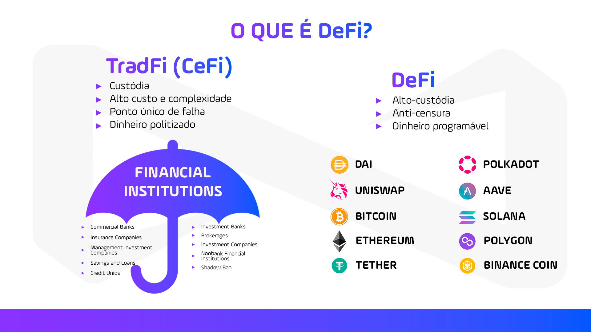
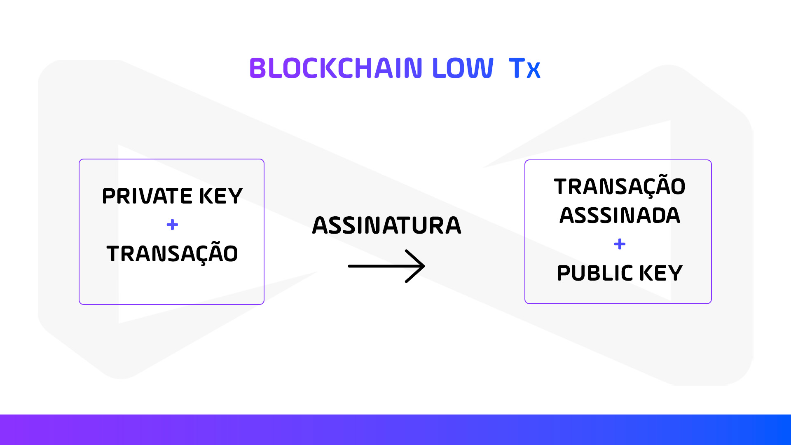

<h1 align="center">🚀 NearX - Stellar Bootcamp</h1>

<h1 align="center">

:pushpin: [Aula 1 - DeFi & Economia Tokenizada: Tokens, Criptomoedas e Web3 Desvendados](https://www.youtube.com/live/ZxGUWEGKgZ8?si=pxw_EkvV__Y0H51Y)

</h1>

<p align="left">

### O que é DeFi? 
<p align="center">
  
</p>

**DeFi**, ou **Decentralized Finance (Finanças Descentralizadas)**, é um movimento que utiliza tecnologia blockchain para criar serviços financeiros sem a necessidade de intermediários tradicionais, como bancos ou corretoras.

#### Aqui estão alguns pontos-chave sobre o DeFi:

- **Descentralização:** As transações ocorrem diretamente entre os usuários, sem a necessidade de autoridades centralizadas.

- **Contratos Inteligentes:** Utilizam programas autoexecutáveis (smart contracts) para automatizar operações financeiras, como empréstimos e pagamentos.

- **Transparência:** Todas as transações são registradas na blockchain, tornando-as auditáveis e transparentes.

- **Acessibilidade:** Qualquer pessoa com acesso à internet pode participar, eliminando processos burocráticos complexos.

- **Interoperabilidade:** Muitos protocolos DeFi são projetados para funcionar de forma integrada com outros serviços dentro do ecossistema blockchain.

<br>

O **DeFi** está revolucionando a forma como lidamos com serviços financeiros, oferecendo mais autonomia, eficiência e transparência.

Por outro lado, temos o **TradFi**, ou **Traditional Finance (Finanças Tradicionais)**, que opera dentro de um sistema mais estruturado e regulamentado, mas com maior dependência de intermediários e processos burocráticos.

#### Comparando TradFi e DeFi

| Aspecto                | TradFi                            | DeFi                               |
|------------------------|-----------------------------------|------------------------------------|
| **Centralização**      | Instituições Financeiras          | Blockchain                         |
| **Intermediação**      | Necessário                        | Não necessário                     |
| **Transparência**      | Limitada                          | Alta, graças à blockchain          |
| **Acesso**             | Restrito                          | Acessível a qualquer pessoa com internet |
| **Segurança**          | Regulamentado                     | Contratos inteligentes e blockchain |
| **Eficiência**         | Processos mais lentos e caros     | Automação e eficiência com contratos inteligentes |

<br>

Enquanto o **TradFi** oferece segurança e regulamentação dentro de um sistema centralizado, o **DeFi** proporciona maior transparência, acessibilidade e eficiência através da descentralização e da automação. Ambos têm seus méritos e limitações, e o futuro pode ver uma integração maior entre essas duas abordagens, trazendo o melhor dos dois mundos para os usuários.

<br>

### O que é economia tokenizada?
<p align="center">
  
</p>

A **economia tokenizada** é um conceito inovador que está ganhando destaque, especialmente com o avanço das tecnologias de blockchain e criptografia. Em essência, trata-se da criação de tokens digitais que representam ativos do mundo real ou virtuais. Esses tokens podem ser utilizados para uma variedade de finalidades, como transações, investimentos e até programas de fidelidade.

<br>

A economia tokenizada e o dinheiro programável são conceitos complementares que estão impulsionando a transformação digital do setor financeiro.

#### Economia Tokenizada:

- **Tokens Digitais:** Representam ativos do mundo real ou virtuais, facilitando a negociação e a transação desses ativos na blockchain.

- **Blockchain:** Tecnologia que sustenta a economia tokenizada, garantindo segurança e transparência nas transações.

- **Transparência e Segurança:** Transações registradas na blockchain são difíceis de adulterar, promovendo confiança.

- **Descentralização:** Elimina a necessidade de intermediários, como bancos e corretores.

- **Acessibilidade:** Democratiza o acesso a investimentos e transações, tornando-os mais acessíveis a um público mais amplo.

#### Dinheiro Programável:

- **Contratos Inteligentes:** Contratos autoexecutáveis com termos escritos em código, garantindo que condições específicas sejam cumpridas antes da liberação dos fundos.

- **Autonomia e Eficiência:** Reduz a necessidade de intermediários, diminuindo custos e aumentando a eficiência.

- **Personalização:** Permite soluções financeiras personalizadas, como pagamentos automáticos e gestão de doações.

- **Segurança:** Garantida pela tecnologia blockchain, difícil de ser adulterada.

- **Transparência:** Regras e transações são transparentes e imutáveis, promovendo maior confiança entre as partes.

Ambos os conceitos são partes essenciais da nova era das finanças digitais, oferecendo mais flexibilidade, segurança e eficiência.

<br>

### Tokenecomics Stellar, principais DeFi.
<p align="center">
  
</p>

#### Tokenomics do Stellar (XLM)

- **Nome:** Stellar Lumens (XLM)

- **Fundo de Desenvolvimento:** A Stellar Development Foundation (SDF) é responsável pelo desenvolvimento e promoção da rede Stellar.

- **Oferta Total:** 50 bilhões de XLM.

- **Oferta Circulante:** 28,9 bilhões de XLM.

- **Uso:** XLM é usado para pagar taxas de transação na rede Stellar e como uma ponte para facilitar transações internacionais.

- **Consensus Protocol:** Stellar usa o Stellar Consensus Protocol (SCP), que é um mecanismo de consenso federado que não depende de mineração.

- **Velocidade:** A rede Stellar pode processar até 1.000 transações por segundo.

- **Interoperabilidade:** Permite a criação e troca de ativos digitais, facilitando a integração com o sistema financeiro tradicional.

#### Principais Protocolos DeFi

- **Aave (AAVE):** Plataforma descentralizada para empréstimos e empréstimos flash.

- **Maker (MKR):** Criador do stablecoin DAI e plataforma para empréstimos descentralizados.

- **Uniswap (UNI):** Exchange descentralizada de criptomoedas que permite a negociação sem intermediários.

- **Chainlink (LINK):** Fornece dados externos para contratos inteligentes, essencial para muitas aplicações DeFi.

- **PancakeSwap (CAKE):** Exchange descentralizada na Binance Smart Chain, conhecida por suas taxas baixas.

- **Avalanche (AVAX):** Plataforma de contratos inteligentes rápida e escalável.

- **Ethereum (ETH):** A maior plataforma DeFi, onde muitos projetos DeFi são construídos.

- **Fantom (FTM):** Rede de blockchain projetada para alta escalabilidade e baixo custo.

- **Lido DAO (LDO):** Plataforma para staking de ativos em várias redes blockchain.

- **Jupiter (JUP):** Protocolo DeFi que facilita a interoperabilidade entre diferentes blockchains.

Esses protocolos são alguns dos principais exemplos de como o DeFi está transformando o setor financeiro, oferecendo soluções descentralizadas, transparentes e acessíveis.

<br>

### O que são Tokens, Assets e Criptomoedas?
<p align="center">
  
</p>

A imagem oferece uma visão clara e relevante sobre os diferentes componentes e camadas do ecossistema de blockchain e criptomoedas, destacando suas interações e integrações. Ela ilustra um diagrama com várias camadas que fazem parte deste ecossistema, incluindo tokens, ativos, NFTs e criptomoedas. Aqui está um resumo das camadas apresentadas:

- **Camada de Agregação (Aggregation layer):** Inclui Agregador 1, Agregador 2 e Agregador 3.
  - Esta camada agrupa e consolida dados de várias fontes diferentes, fornecendo uma visão abrangente dos ativos disponíveis, taxas de câmbio, oportunidades de empréstimo, etc. Esses agregadores facilitam a busca e comparação de informações para os usuários.

- **Camada de Aplicação (Application layer):** Inclui várias aplicações, como troca, empréstimo, derivativos, gestão de ativos, entre outras.
  - Esta camada é onde os usuários interagem diretamente com diferentes serviços financeiros. Aplicações de troca permitem a compra e venda de criptomoedas, aplicações de empréstimo permitem que usuários emprestem e tomem emprestado criptomoedas, e as aplicações de derivativos permitem a negociação de contratos baseados em criptomoedas. A gestão de ativos inclui ferramentas e serviços para ajudar os usuários a gerenciar seus investimentos.

- **Camada de Protocolo (Protocol layer):** Inclui protocolos para troca, empréstimo, derivativos e gestão de ativos.
  - Estes são os "regramentos" ou "contratos" que governam as operações das aplicações. Eles definem como as transações são realizadas, verificadas e registradas. Cada tipo de aplicação (troca, empréstimo, etc.) tem protocolos específicos que asseguram sua funcionalidade e segurança.

- **Camada de Ativos (Asset layer):** Inclui ativos nativos do protocolo (ETH), tokens fungíveis (ERC-20) e tokens não fungíveis (ERC-721).
  - Esta camada inclui todos os tipos de ativos digitais. O ETH (Ethereum) é o ativo nativo da blockchain Ethereum. Tokens fungíveis (ERC-20) são tokens que têm o mesmo valor e são intercambiáveis (como moedas). Tokens não fungíveis (ERC-721) são únicos e não intercambiáveis, frequentemente usados para representar itens digitais colecionáveis ou arte digital (NFTs).

- **Camada de Liquidação (Settlement layer):** Inclui a blockchain Ethereum.
  - Esta é a camada onde as transações são finalizadas e registradas de forma permanente. A blockchain Ethereum é um ledger distribuído que assegura que todas as transações são transparentes, imutáveis e verificáveis por qualquer pessoa.

- **Camada 0 (Layer 0):** Inclui ferramentas de desenvolvimento e linguagens como Cosmos SDK, Polkadot SDK, Rust, Java, Golang e C/C++.
  - Esta camada inclui as ferramentas e tecnologias básicas usadas para criar e desenvolver todas as outras camadas e aplicações. As ferramentas de desenvolvimento ajudam os programadores a criar blockchains e dApps (aplicações descentralizadas) de forma mais eficiente. As linguagens de programação são usadas para escrever o código que alimenta esses sistemas.

Cada camada desempenha um papel essencial no funcionamento geral do ecossistema de criptomoedas e blockchain, desde a base tecnológica até a interação direta do usuário.

<br>

### Como funciona a web3?
<p align="center">
  
</p>

A Web3 representa uma nova era da internet, onde a descentralização é a chave. Em vez de depender de intermediários centralizados, os aplicativos e serviços na Web3 utilizam a tecnologia blockchain para operar de forma independente e segura.

#### Vamos desvendar os principais elementos:

- **Desenvolvedor (DEV):** O processo começa com o desenvolvedor que cria o código e os aplicativos.

- **Contrato Inteligente (SMARTCONTRACT):** O desenvolvedor programa contratos inteligentes, que são essencialmente contratos autoexecutáveis com os termos do acordo diretamente escritos no código.

- **Backend e Frontend:** Os contratos inteligentes se conectam tanto ao backend (parte do aplicativo que gerencia a lógica e a base de dados) quanto ao frontend (a interface do usuário).

- **Carteira (WALLET):** A interface do usuário se conecta a uma carteira digital, que é usada para gerenciar as criptomoedas e outras chaves digitais.

- **Usuário (USER):** O usuário interage com o frontend do aplicativo e usa a carteira para realizar transações.

<br>

### Como a Stellar se encaixa no mundo web3?

A **Stellar** é uma plataforma blockchain projetada para facilitar transações financeiras rápidas e acessíveis em todo o mundo. Ela se encaixa na Web3 ao permitir a criação e troca de ativos digitais (tokens) de maneira descentralizada e segura. Aqui estão alguns pontos-chave sobre como a Stellar se integra à Web3:

 - **Tokenização de Ativos:** A Stellar permite a criação de tokens representando ativos financeiros ou outros tipos de valor, facilitando a troca e a liquidez.

- **Transações Rápidas e Econômicas:** A Stellar oferece taxas de transação muito baixas e tempos de processamento rápidos, o que é crucial para aplicações financeiras em tempo real.

- **Interoperabilidade:** A Stellar se conecta a várias moedas fiduciárias e outras plataformas blockchain, permitindo a transferência de valor entre diferentes sistemas.

- **Desenvolvimento de Aplicações:** A Stellar fornece ferramentas e SDKs (kits de desenvolvimento de software) que facilitam a criação de aplicativos descentralizados (dApps) e contratos inteligentes.

- **Foco em Inclusão Financeira:** A Stellar tem como objetivo tornar os serviços financeiros mais acessíveis a pessoas em todo o mundo, especialmente em regiões onde o acesso a serviços bancários tradicionais é limitado.

Em resumo, a **Stellar** é uma plataforma blockchain que se alinha bem com os princípios da Web3, promovendo a descentralização, a interoperabilidade e a inclusão financeira. 

<br>

### Blockchain low-level: wallet
<p align="center">
  
</p>

**Blockchain low-level wallet** é um termo técnico que se refere a um tipo de carteira de criptomoedas que opera diretamente na camada mais baixa da infraestrutura blockchain. Em outras palavras, é uma carteira que interage diretamente com a blockchain sem a necessidade de intermediários ou serviços adicionais.

Essa imagem é relevante pois explica o processo de geração de chaves criptográficas para carteiras blockchain, crucial para garantir transações seguras na tecnologia blockchain.

#### Aqui estão os elementos principais e seu significado:

- **Chave Pública:** GBTIDN5UQ3P4HT3CSIEYU5SF6INX0MYOTU6U5KM67QMXPPUCTABT35U5

  - Utilizada para receber transações na rede blockchain.

- **Chave Privada:** SAKKTW5AEJ07Y5DOGUKINE6NFS5CR370WK3WIX4JWQ7LHOOUIH2VQYR4

  - Mantida em segredo e usada para assinar transações, provando a propriedade dos fundos.

- **Algoritmos Utilizados:**

  - O Stellar usa uma combinação dos algoritmos SHA-256 e RIPEMD-160 para aumentar a segurança: RIPEMD160(SHA256(data)).

- **Passos para a Geração de Chaves:**

  - Um seed aleatório de 256 bits é gerado.

  - Esse seed é hashado usando a função hash SHA-512, produzindo um digest de 512 bits.

  - Os primeiros 256 bits do digest se tornam a chave privada.

  - A chave pública é derivada da chave privada usando o algoritmo ed25519.

#### Aqui estão alguns pontos chave sobre essas carteiras:

- **Chave Privada e Pública:** Cada carteira possui uma chave privada e uma chave pública. A chave privada é um segredo que você deve manter seguro, enquanto a chave pública é usada para receber transações.

- **Transações Diretas:** As carteiras low-level permitem que você envie e receba transações diretamente na blockchain. Isso significa que você tem controle total sobre suas transações sem depender de terceiros.

- **Segurança:** Como você mantém controle direto sobre suas chaves, a segurança das suas transações e fundos depende de como você protege suas chaves privadas.

- **Software e Hardware:** Existem dois tipos principais de carteiras low-level: software wallets (aplicativos que você instala no seu dispositivo) e hardware wallets (dispositivos físicos projetados para armazenar chaves de forma segura).

<br>

### Blockchain low-level: Tx
<p align="center">
  
</p>

A imagem ilustra o processo onde uma chave privada e uma transação são combinadas para criar uma assinatura. Essa assinatura, junto com a chave pública, resulta em uma transação assinada. Esse processo é fundamental na tecnologia blockchain para garantir a autenticidade e a integridade das transações.

<br>


### Blockchain low-level: Blocks
<p align="center">
  
</p>

Essa imagem ajuda a ilustrar como os blocos na blockchain são compostos por conjuntos de transações e como eles se conectam formando uma cadeia contínua. A blockchain é como um livro-razão digital descentralizado que registra todas as transações de forma segura e imutável. Cada bloco contém um conjunto de transações, e todos os blocos estão interligados, formando uma cadeia (daí o nome "blockchain").

#### Aqui estão os principais componentes de um bloco em nível baixo:

- **Cabeçalho do Bloco:** Contém metadados sobre o bloco, como a versão, o hash do bloco anterior, o hash do Merkle root (que é uma árvore hash que resume todas as transações no bloco), um timestamp, a dificuldade de mineração, e o nonce (um número usado uma única vez).

- **Transações:** O bloco contém uma lista de transações. Cada transação representa uma mudança no estado do blockchain, como a transferência de criptomoedas de uma carteira para outra.

- **Hash do Bloco Anterior:** Cada bloco contém um hash criptográfico do bloco anterior. Isso cria uma cadeia de blocos (daí o nome blockchain), onde cada bloco está matematicamente vinculado ao anterior, garantindo a integridade da cadeia.

- **Nonce:** Um valor numérico que é ajustado durante o processo de mineração para encontrar um hash que atenda a certos requisitos de dificuldade.

Esses componentes garantem que o blockchain seja seguro, imutável e transparente. Cada bloco é vinculado ao anterior, formando uma cadeia contínua e linear que é resistente a modificações e fraudes.

<br>

### Blockchain low-level: Consenso
<p align="center">
  
</p>

Consenso de nível baixo (Low Level Consensus) em blockchain refere-se aos mecanismos fundamentais utilizados para alcançar um acordo entre todos os participantes da rede sobre o estado do blockchain. Em outras palavras, é o processo pelo qual todas as partes da rede concordam em um conjunto de dados ou transações para garantir a integridade e a segurança do sistema.

#### Aqui estão os principais mecanismos de consenso:

- **Proof of Work (PoW):**

  - Os mineradores competem para resolver problemas matemáticos complexos.

  - O primeiro a resolver adiciona um novo bloco à cadeia e recebe uma recompensa.

  - Este método é seguro, mas consome muita energia.

- **Proof of Stake (PoS):**

  - Em vez de mineradores, existem validadores que são escolhidos com base na quantidade de criptomoeda que possuem e estão dispostos a "apostar" como garantia.

  - Reduz o consumo de energia comparado ao PoW.

  - A segurança é baseada na quantidade de valor apostado.

- **Stellar Consensus Protocol (SCP):**

  - Utiliza o protocolo [Federated Byzantine Agreement (FBA)](./docs/protocol-fba.md).

  - Os nós se dividem em pequenos grupos chamados de quorum slices.

  - Alcança consenso rápido com menos consumo de energia.

O consenso é essencial para o funcionamento das blockchains, garantindo que todos os participantes tenham uma visão uniforme do ledger e que transações fraudulentas sejam evitadas.

<br>

### Blockchain low-level: SmartContracts
<p align="center">
  
</p>

Contratos inteligentes são programas de computador que são executados em uma blockchain. Eles são definidos por códigos e regras pré-estabelecidas que são automaticamente executadas quando determinadas condições são atendidas. 

#### Aqui estão alguns pontos importantes:

- **Autonomia:** Os contratos inteligentes operam de forma automática sem a necessidade de intermediários.

- **Imutabilidade:** Uma vez implantados na blockchain, os contratos inteligentes não podem ser alterados.

- **Transparência:** Todas as transações e operações executadas pelos contratos inteligentes são visíveis na blockchain.

#### Blockchain Low-Level

No nível mais baixo, a blockchain e os contratos inteligentes envolvem várias camadas técnicas e componentes:

 - **Linguagem de Programação:** Contratos inteligentes são geralmente escritos em linguagens específicas como Solidity para Ethereum, ou Rust e AssemblyScript para outras plataformas de blockchain como Polkadot.

- **Compilação:** O código do contrato inteligente é compilado em bytecode, que pode ser entendido e executado pela máquina virtual da blockchain (como a Ethereum Virtual Machine, EVM).

- **Máquina Virtual (VM):** A VM é um ambiente de execução isolado que garante que o código seja executado de forma segura e consistente em todos os nós da rede.

- **Transações e Eventos:** Os contratos inteligentes podem enviar e receber transações, emitir eventos que outros contratos ou usuários podem ouvir e responder.

- **Persistência:** O estado dos contratos inteligentes (como saldos de contas e outros dados) é armazenado na blockchain e pode ser acessado e modificado pelas funções do contrato.

#### Exemplo Prático

Este é um exemplo de um contrato inteligente simples escrito em Solidity. Ele permite armazenar e recuperar um valor na blockchain.

##### Contrato Solidity

```solidity 
pragma solidity ^0.8.0;

contract SimpleStorage {
    uint256 public data;

    function setData(uint256 _data) public {
        data = _data;
    }

    function getData() public view returns (uint256) {
        return data;
    }
}
```
#### Descrição

- setData: Esta função permite definir o valor da variável data.

- getData: Esta função retorna o valor atual armazenado na variável data.

#### Como Usar

- **Implante o Contrato:** Implante o contrato na blockchain usando uma ferramenta como Remix, Truffle, ou Hardhat.

- **Interaja com o Contrato:**

  - Use a função setData para armazenar um valor.

  - Use a função getData para recuperar o valor armazenado.

- **Requisitos**
  - Solidity ^0.8.0

</p>


<br>

## Aula 2

- Fundamentos sobre Stellar.
- Configurando FullNode e DevOps.
- Interagindo com o FullNode usando SDK.

# Aula 3

- Ecosistema de sistema de desenvolvimento Rust.
- Básico sobre Rust.
- Basico de smartcontrats Soroban (Hello World).

## Aula 4

- Flipando bits (Flipper).
- Entendo sobre armazenamento (Counter).
- Avançando em lógica (Task manager).

# Aula 5

- Noções avançadas de Soroban

## :memo: Licença

Esse projeto está sob a licença MIT. Veja o arquivo [LICENSE](https://github.com/git/git-scm.com/blob/master/MIT-LICENSE.txt) para mais detalhes.

---

Feito com 💜 by <a href="https://www.linkedin.com/in/danielgorgonha/">Daniel R Gorgonha</a> :wave: